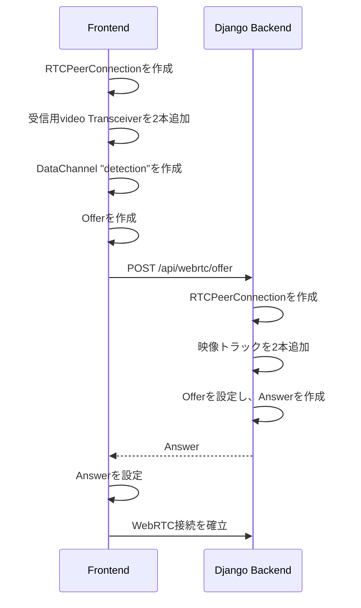

# WebRTCによる通信基盤

## 1. 構成

- バックエンドはPythonとDjangoで動作する。
- フロントエンドはReactで動作する。
- バックエンドとフロントエンドは同一PC内でのみ通信する。
- シグナリング用HTTP APIおよびWebRTC通信先は `localhost` に限定する。
- カメラ映像と骨格映像はWebRTCの映像トラックで送る。
- 骨格座標・動作判定・途中値はWebRTCのDataChannelで送る。
- 接続が切断された場合、フロントエンドは自動的に接続を再確立する。

WebRTCで送る検知データのJSON構造は、[アプリケーション設計](README.md)を参照する。

aiortcは、Djangoのリクエスト処理とは別の専用`asyncio`イベントループで実行する。
これにより、Djangoの通常の起動方法でもWebRTC接続を継続して管理できる。

## 2. 接続確立

フロントエンドをWebRTC接続の開始側とする。フロントエンドがOfferを作成してバックエンドへ送信し、バックエンドがAnswerを返す。



### シグナリングAPI

#### `POST /api/webrtc/offer`

フロントエンドが作成したOfferをバックエンドへ渡す。

リクエスト:

```json
{
  "type": "offer",
  "sdp": "..."
}
```

レスポンス:

```json
{
  "type": "answer",
  "sdp": "..."
}
```

バックエンドは新しいOfferを受信した場合、既存の接続を閉じてから新しい`RTCPeerConnection`を作成する。同時接続は1つだけ保持する。

## 3. 映像トラック

バックエンドは次の2本の映像トラックを追加する。

| 順序 | 映像 | フロントエンドでの受信先 |
| --- | --- | --- |
| 1 | カメラ映像 | `CameraVideo` |
| 2 | 骨格映像 | `SkeletonVideo` |

フロントエンドはOffer作成前に、受信専用のvideo Transceiverをこの順序で2本追加する。`ontrack` イベントでは、どちらのTransceiverで受信したかによって映像を振り分ける。

```ts
const cameraTransceiver = peerConnection.addTransceiver('video', {
  direction: 'recvonly',
})
const skeletonTransceiver = peerConnection.addTransceiver('video', {
  direction: 'recvonly',
})
```

バックエンドは、1台のカメラ入力を共有してカメラ映像と骨格映像を生成する。フロントエンドがカメラへ直接アクセスすることはない。

最初の実装では、1本目のカメラ映像トラックだけを送信する。骨格映像トラックはMediaPipeの実装時に追加する。

## 4. DataChannel

フロントエンドがOffer作成前に、`detection` という名前のDataChannelを1本作成する。バックエンドは受信したDataChannelの名前を確認して検知データの送信先として使用する。

```ts
const detectionChannel = peerConnection.createDataChannel('detection', {
  ordered: false,
  maxRetransmits: 0,
})
```

- DataChannelは最新の検知データを優先する。
- 送信遅延により古くなったデータは再送しない。
- バックエンドは解析フレームごとに、検知データ全体をJSON文字列として送る。
- DataChannelが開いていない間は、検知データを蓄積しない。

## 5. バックエンドの接続管理

バックエンドは、接続中の`RTCPeerConnection`、`detection` DataChannel、カメラ処理を管理する。

### モジュール構成

```text
backend/webrtc/
├─ api/
│  ├─ urls.py               # POST /api/webrtc/offer のURL定義
│  └─ views.py              # Offerを受け付け、Answerを返すDjango View
├─ rtc/
│  ├─ session.py            # aiortcのRTCPeerConnectionとDataChannelを管理
│  └─ video_tracks.py       # カメラ映像・骨格映像のMediaStreamTrack
├─ vision/
│  ├─ camera.py             # カメラを開き、フレームを取得
│  ├─ mediapipe_detector.py # MediaPipe Pose・Handsで骨格を検知
│  ├─ skeleton_renderer.py  # 骨格情報をカメラ映像へ描画
│  └─ processing_loop.py    # カメラ取得からWebRTC送信までを順に実行
└─ detection/
   ├─ action.py             # 既存のaction()による動作判定
   ├─ action_evaluator.py   # 判定結果を送信用の動作名へ対応づける
   └─ serializer.py         # MediaPipeと判定結果を送信用JSONへ変換
```

### 処理の分担

| モジュール | 担当 |
| --- | --- |
| `api/views.py` | Offerを受け取り、`rtc/session.py`にAnswerの作成を依頼して返す。 |
| `rtc/session.py` | `RTCPeerConnection`を作成し、映像トラックの追加、`detection` DataChannelの受信、接続の終了処理を行う。 |
| `vision/processing_loop.py` | カメラフレームを受け取り、骨格検知、動作判定、骨格映像作成、JSON化、WebRTC送信を順番に呼び出す。 |
| `vision/camera.py` | カメラを唯一開き、カメラ映像のフレームを返す。 |
| `vision/mediapipe_detector.py` | カメラフレームから`pose_results`と`hands_results`を返す。 |
| `detection/action.py` | 既存の`action()`による動作判定を行う。 |
| `detection/action_evaluator.py` | `action()`を呼び出し、`actions`と`actionDetails`を作成する。 |
| `vision/skeleton_renderer.py` | カメラフレームとMediaPipeの検知結果から、骨格を描画した映像フレームを返す。 |
| `rtc/video_tracks.py` | `vision/processing_loop.py`が生成したカメラ映像と骨格映像を、それぞれWebRTC映像トラックとして提供する。 |
| `detection/serializer.py` | `pose_results`、`hands_results`、動作判定結果を[アプリケーション設計](README.md)のJSON構造へ変換する。 |

### バックエンドの処理フロー

`processing_loop` は、各フレームで次の処理を順番に実行する。

`action()`のインスタンスは、処理ループの開始前に1回だけ作成して使い続ける。これにより、既存のジャンプ判定に必要な過去フレームや、Tポーズの維持時間を保持できる。

```text
camera_capture.read()
  → カメラ映像フレーム
  → mediapipe_detector.detect()
  → pose_results / hands_results
  → action()の既存判定メソッドを呼び出す
  → actions / actionDetails
  → skeleton_renderer.render()
  → 骨格映像フレーム
  → detection_serializer.serialize_detection()
  → 検知データJSON
  → rtc_session.publish()
  ├─ CameraVideoTrackへカメラ映像フレームを渡す
  ├─ SkeletonVideoTrackへ骨格映像フレームを渡す
  └─ detection DataChannelへ検知データJSONを送る
```

カメラ映像、骨格映像、検知データJSONは、必ず同じ解析フレームから生成する。

### 検知データをDataChannelへ渡す方法

`processing_loop` は解析フレームごとに、`detection_serializer`で検知データの辞書を作る。辞書をJSON文字列に変換し、`rtc_session`が保持する`detection` DataChannelへ渡す。

```python
payload = serialize_detection(
    pose_results=pose_results,
    hands_results=hands_results,
    actions=actions,
    action_details=action_details,
)

if detection_channel is not None and detection_channel.readyState == "open":
    detection_channel.send(json.dumps(payload))
```

- `serialize_detection` は、Poseの33点、Handsの各21点、`actions`、`actionDetails`を含む辞書を返す。
- DataChannelが開いていない場合は送信せず、過去の検知データも保存しない。
- `readyState`が`open`のときだけ送信する。`aiortc`では、開いていないDataChannelに対する`send()`は例外になる。

### 映像トラックへの渡し方

`processing_loop` は、解析した最新フレームをカメラ映像用と骨格映像用にそれぞれ保持する。`CameraVideoTrack`と`SkeletonVideoTrack`は、その最新フレームを`recv()`で取得してWebRTCへ送る。

- 映像用のフレーム保持領域は各トラックにつき1つとする。
- 新しいフレームが生成された場合は、まだ送信していない古いフレームを置き換える。
- 映像も検知データと同様に、古いフレームを蓄積せず最新状態を優先する。

- Offerを受信したら、`RTCPeerConnection`を作成する。
- カメラ映像と骨格映像のトラックを追加する。
- フロントエンドが作成した`detection` DataChannelを受信する。
- DataChannelが`open`になった後、解析フレームごとにJSONを送信する。
- 接続状態が`failed`、`disconnected`、`closed`のいずれかになった場合、`RTCPeerConnection`を閉じて参照を解放する。
- 新しいOfferが来た場合も、既存接続を閉じてから新しい接続へ切り替える。

## 6. フロントエンドの接続管理

### `useWebRTC` Hook

WebRTC通信はReactのカスタムHookである `useWebRTC` に実装する。`App.tsx` はWebRTCの接続処理を持たず、このHookを呼び出す。

`useWebRTC` は次の値を返す。

```ts
{
  cameraStream: MediaStream | null,
  skeletonStream: MediaStream | null,
  detectionData: DetectionData | null,
}
```

- `cameraStream` はカメラ映像用のWebRTC映像ストリームである。
- `skeletonStream` は骨格映像用のWebRTC映像ストリームである。
- `detectionData` はDataChannelから最後に受信した検知データ全体である。

### Hookが担当する処理

`useWebRTC` がWebRTC通信の全体を管理する。

- Hookの開始時に`RTCPeerConnection`、映像Transceiver、`detection` DataChannelを作成する。
- Offerを作成し、`POST /api/webrtc/offer` を呼び出してAnswerを設定する。
- `ontrack` で受信した映像ストリームを、カメラ映像用と骨格映像用にそれぞれ保持する。
- DataChannelの`message`イベントで受信したJSONを、最新の検知データとして保持する。
- 接続が切断された場合、既存の接続を閉じてから接続確立処理を再実行する。
- Hookの破棄時はDataChannelと`RTCPeerConnection`を閉じる。
