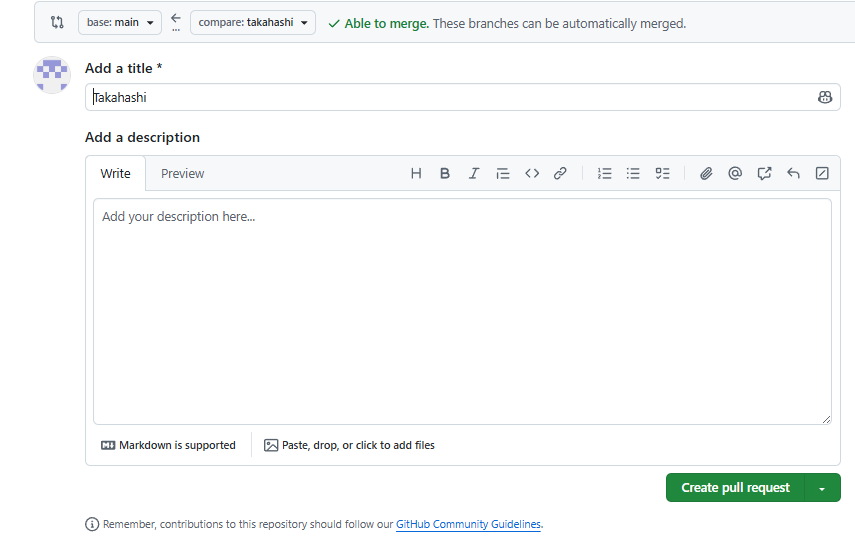

# プルリクエストまでの手順
- 任意のディレクトリに移動（パスに日本語を含まないようにする）
- リポジトリをクローンし，該当ディレクトリに移動
```bash
git clone https://github.com/takaaaa-jun/2026_opencampus_project2
cd 2026_opencampus_project2
```

- テスト用に自分の名前のブランチを作成
```bash
git switch -c (苗字(ローマ字))
# (例) git switch -c takahashi
```

- ファーストコミット用のディレクトリに移動し，テストファイルを作成
```bash
cd test/first_commit
echo "苗字(ローマ字)" > (苗字(ローマ字)).txt
# (例) echo "takahashi" > takahashi.txt
```

- 先ほど作成した自分用のテストブランチに変更をプッシュ
```bash
git add .
git commit -m "(苗字(ローマ字))_first_commit"
# (例) git commit -m "takahashi_first_commit"
# ※コミットのコメントは，何を変更したのかが分かるようにしましょう．
git push -u origin (苗字(ローマ字))
# (例) git push -u origin takahashi
```

- プルリクエストの作成
  - メッセージは自由に書いてみてください．
  - 「create pull request」を押してみてください．


:::note warm
注意
細かい操作は各自で調べてください．
:::